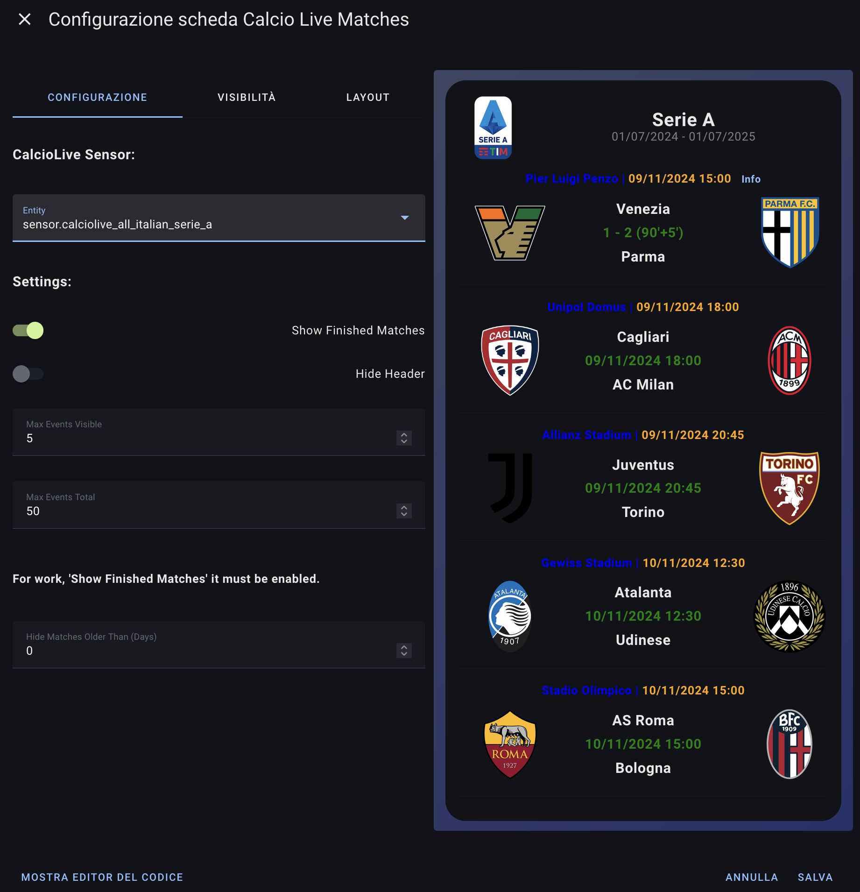
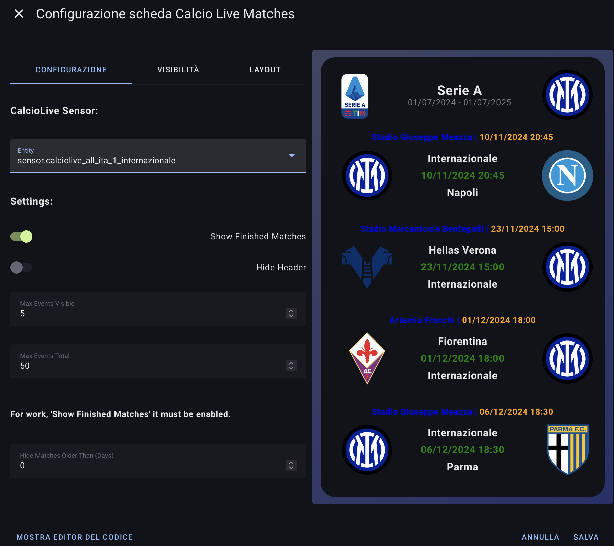
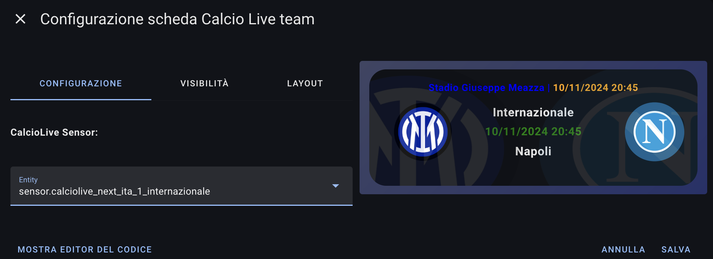

# Calcio Live - Home Assistant Card
## Supportami  
Se ti piace il mio lavoro e vuoi che continui nello sviluppo delle card, puoi offrirmi un caffè.

Non dimenticare di seguirmi sui social:

## Video Guida
Il video è basato sulla versione 2.0.1, nella versione 2.1.0 è stata introdotta la parte grafica.

[Guarda il video su YouTube](https://www.youtube.com/watch?v=K-FAJmwsGXs)

## Descrizione
L'integrazione "Calcio Live" per Home Assistant permette di ottenere informazioni in tempo reale sulle competizioni di calcio, come classifiche, cannonieri e giornate di campionato.
Queste sono le sue card, ho deciso di separare le card per dare modo di scegliere cosa usare e cosa no.

## Installazione tramite HACS
1. Aggiungi il repository `https://github.com/Bobsilvio/calcio-live-card` in HACS come DASHBOARD.
    
    
2. Cerca "Calcio Live Card" in HACS e installa l'integrazione.
    

## Utilizzo delle card

Ci sono 4 tipi di card e vi riporto degli esempi, dico 4 perchè una card è la stessa in base al sensore che si seleziona, ovvero quella di tutte le partite del campionato o del team.
---

### Classifica
---

| **Impostazione**         | **Descrizione**                                                                 |
|---------------------------|---------------------------------------------------------------------------------|
| **sensor**                | Il filtro avviene in automatico, bisogna solo selezionarlo.                    |
| **hide header**           | Nasconde la barra superiore con le intestazioni (per risparmiare spazio).      |
| **max events visible**    | Il numero di partite visibili nella card (escluse nello scroll).               |

---

### Campionato
---

| **Impostazione**         | **Descrizione**                                                                 |
|---------------------------|---------------------------------------------------------------------------------|
| **sensor**                | Il filtro avviene in automatico, bisogna solo selezionarlo.                    |
| **show finished matches** | Mostra le partite concluse quando è attivato (altrimenti solo quelle future).  |
| **hide header**           | Nasconde la barra superiore con le intestazioni (per risparmiare spazio).      |
| **max events visible**    | Il numero di partite visibili nella card (escluse nello scroll).               |
| **max events total**      | Il numero totale di partite (comprese nello scroll).                           |

Quindi se imposto visible a 5 e total a 10, vedrò solo 5 nella card e altre 5 scrollando la card.

---

### Squadra tutte
---

| **Impostazione**         | **Descrizione**                                                                 |
|---------------------------|---------------------------------------------------------------------------------|
| **sensor**                | Il filtro avviene in automatico, bisogna solo selezionarlo.                    |
| **show finished matches** | Mostra le partite concluse quando è attivato (altrimenti solo quelle future).  |
| **hide header**           | Nasconde la barra superiore con le intestazioni (per risparmiare spazio).      |
| **max events visible**    | Il numero di partite visibili nella card (escluse nello scroll).               |
| **max events total**      | Il numero totale di partite (comprese nello scroll).                           |
| **hide matches older**    | Nasconde le partite più vecchie dei giorni impostati.                          |

---

### Squadra Singola
---

| **Impostazione**         | **Descrizione**                                                                 |
|---------------------------|---------------------------------------------------------------------------------|
| **sensor**                | Il filtro avviene in automatico, bisogna solo selezionarlo.                    |

---

## Informazioni
Questa è la mia prima card e sicuramente c'è tanto lavoro da fare, se vi piace, potete ricambiare seguendomi nei social:

TikTok: @silviosmartalexa
