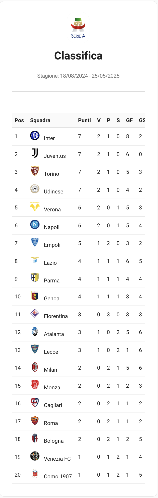
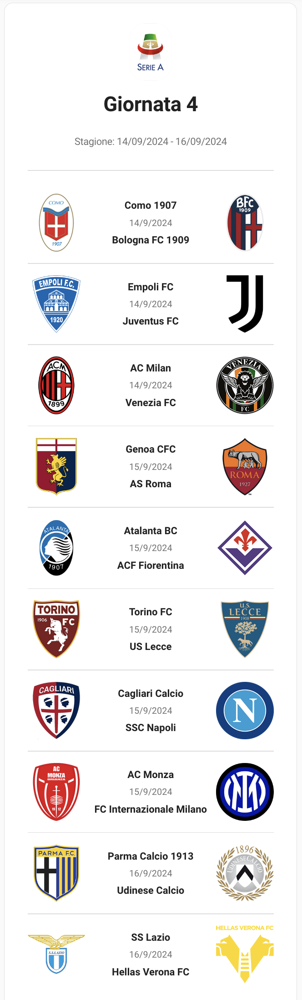
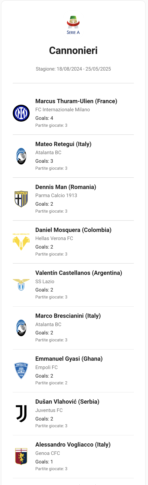
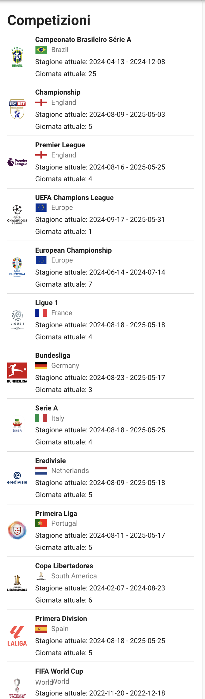

# Calcio Live - Home Assistant Card

## Descrizione
L'integrazione "Calcio Live" per Home Assistant permette di ottenere informazioni in tempo reale sulle competizioni di calcio, come classifiche, cannonieri e giornate di campionato.
Queste sono le sue card, ho deciso di separare le card per dare modo di scegliere cosa usare e cosa no.

## Installazione tramite HACS
1. Aggiungi il repository `https://github.com/tuo_username/calcio-live-card` in HACS.
    
    
2. Cerca "Calcio Live Card" in HACS e installa l'integrazione.
    

## Utilizzo delle card
Ci sono 4 tipi di card e vi riporto degli esempi
Ricordatevi che il sensore prende il nome dal parametro che avete dato sull'integrazione,
quindi se avete dato 'Serie A' verrà chiamato 'seriea'

  Classifica Card:
    type: custom:calcio-live-classifica
    entity: sensor.calciolive_seriea_classifica
    
    
  
  Match Day Card:
    type: custom:calcio-live-matches
    entity: sensor.calciolive_seriea_match_day
    
    
    
   Cannonieri Card:
    type: custom:calcio-live-cannonieri
    entity: sensor.calciolive_seriea_cannonieri
    
    

   Competizioni Card: (è uguale per tutti i sensori che create)
     type: custom:calcio-live-competizioni
     entity: sensor.calciolive_seriea_competizioni
   
     

## Informazioni
Questa è la mia prima card e sicuramente c'è tanto lavoro da fare, se vi piace, potete ricambiare seguendomi nei social:

TikTok: @silviosmartalexa