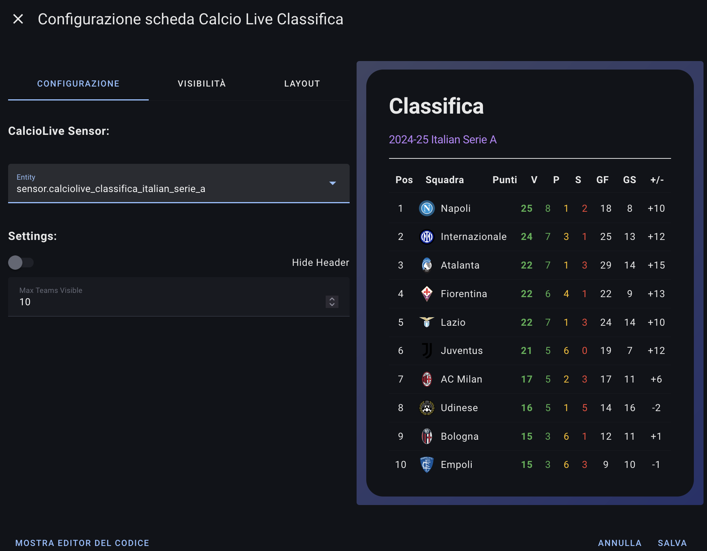

# Calcio Live - Home Assistant Card
## Supportami  
Se ti piace il mio lavoro e vuoi che continui nello sviluppo delle card, puoi offrirmi un caffè.

Non dimenticare di seguirmi sui social:

## Descrizione
L'integrazione "Calcio Live" per Home Assistant permette di ottenere informazioni in tempo reale sulle competizioni di calcio, come classifiche, cannonieri e giornate di campionato.
Queste sono le sue card, ho deciso di separare le card per dare modo di scegliere cosa usare e cosa no.

## Installazione tramite HACS
1. Aggiungi il repository `https://github.com/Bobsilvio/calcio-live-card` in HACS come DASHBOARD.
    
    
2. Cerca "Calcio Live Card" in HACS e installa l'integrazione.
    

## Utilizzo delle card
Ci sono 4 tipi di card e vi riporto degli esempi
Ricordatevi che il sensore prende il nome dal campionato o dal team, lo fa in automatico quindi dovete solo cliccare e vedere il suo nome.

E' possibile inoltre ridurre sia il numero di righe da visualizzare e sia il numero di eventi totali, quindi se voglio visualizzare 5 eventi e 10 totali,
vedro i primi 5 sempre e i restanti 5 tramite scroll.

Inoltre per le card è possibile nascondere l'intestazione iniziale per ridurre ulteriormente la card.

<!-- Squadra Card -->
<table>
  <tr>
    <td>
      <strong>Squadra Card Prossima di Campionato:</strong> 
      <pre>type: custom:calcio-live-team-next entity: sensor.calciolive_team_110_internazionale_next</pre>
    </td>
  </tr>
  <tr>
    <td></td>
  </tr>
</table>

<table>
  <tr>
    <td>
      <strong>Squadra Card Concluse Campionato:</strong> 
      <pre>type: custom:calcio-live-team-matches entity: sensor.calciolive_team_110_internazionale max_events_visible: 5 max_events_total: 10 hide_header: false
</pre>
    </td>
  </tr>
  <tr>
    <td></td>
  </tr>
</table>

<!-- Classifica Card -->
<table>
  <tr>
    <td>
      <strong>Classifica Card:</strong> 
      <pre>type: custom:calcio-live-classifica entity: sensor.calciolive_serie_a_classifica max_teams_visible: 10 hide_header: false</pre>
    </td>
  </tr>
  <tr>
    <td></td>
  </tr>
</table>

<!-- Match Day Card -->
<table>
  <tr>
    <td>
      <strong>Match Week:</strong> 
      <pre>type: custom:calcio-live-today-matches entity: sensor.calciolive_serie_a_match_day max_events_visible: 5 max_events_total: 10 show_finished_matches: true hide_header: false</pre>
    </td>
  </tr>
  <tr>
    <td></td>
  </tr>
</table>

## Informazioni
Questa è la mia prima card e sicuramente c'è tanto lavoro da fare, se vi piace, potete ricambiare seguendomi nei social:

TikTok: @silviosmartalexa
